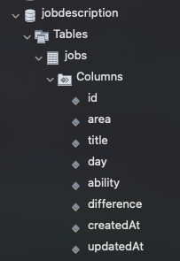
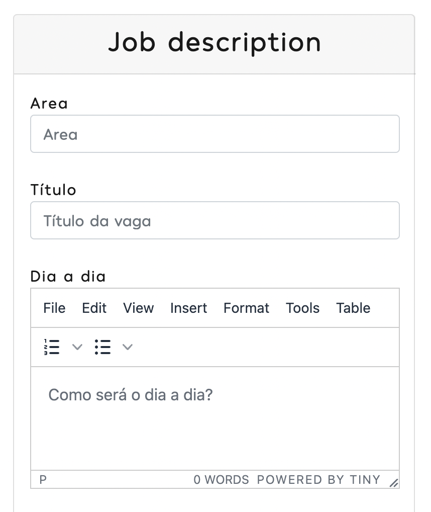
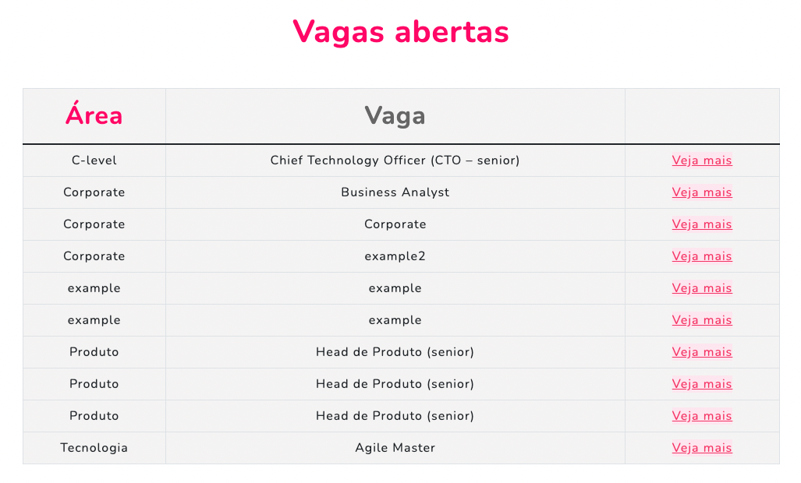

# Career Page - Zapay Pagamentos

  

## Overview
- The main purpose of this project is to build a webpage to show the carrer page from Zapay Pagamentos. The application provides knowledge about my studies on `Node.js`, `EJS` and `MySQL` 

- The theme used was Grayscale by Bootstrap.

  

## 1 - Libraries and Frameworks

- Clone repository: `git clone https://github.com/aleffaso/career_page.git `
- Open the folder on `VSCode` or other coding software
- Install dependencies running: `npm install`

## 2 - Set Database on MySql

- As we use MySQL to build our data base, you can download it at this link if you don't have it already: 
`https://dev.mysql.com/downloads/mysql/ ` 
- Download `MySQL Workbench` at `https://www.mysql.com/products/workbench/`

### 2.1 - Configure database
- After installing `WorkBench` click on `MySQL Connections`:

  

  

- Then go on the top of the page and click on `Create new schema`

  

  

- The name of the `new_schema` must be `jobdescription`

## 3 - Running the application

- Run: `npm install`
- Run: `nodemon index.js`
- If everything works your database will show these columns below:

  

  

- For testing you can go on `localhost:3000/`
- There is this `createjob` route on `localhost:3000/createjob` to test your database and put all information in

  

  

- When you submit the job description, you will have something like this

  

  

# About
Start Bootstrap is an open source library of free Bootstrap themes and templates. All of the free themes and templates on Start Bootstrap are released under the MIT license, which means you can use them for any purpose, even for commercial projects.

- https://startbootstrap.com
- https://twitter.com/SBootstrap

Start Bootstrap was created by and is maintained by David Miller.

- https://davidmiller.io
- https://twitter.com/davidmillerhere
- https://github.com/davidtmiller

Start Bootstrap is based on the Bootstrap framework created by Mark Otto and Jacob Thorton.

# Copyright and License
Copyright 2013-2021 Start Bootstrap LLC. Code released under the MIT license.