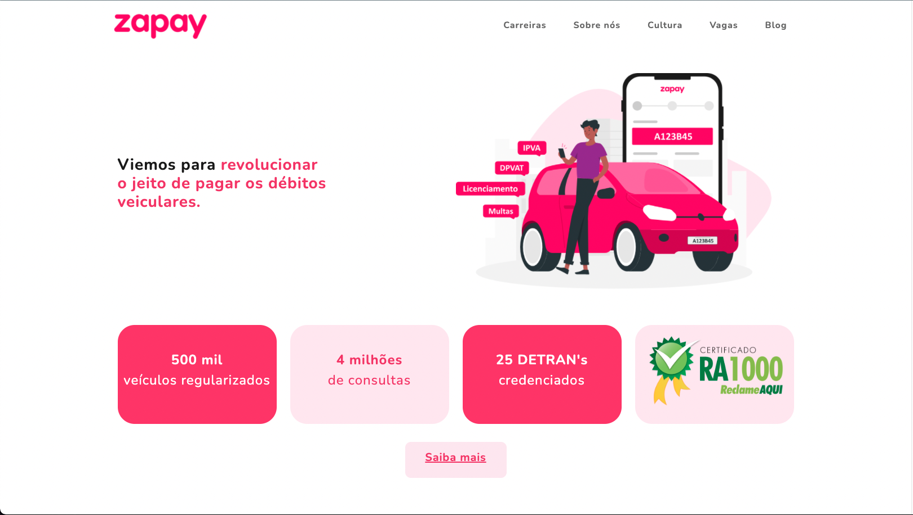
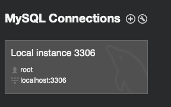
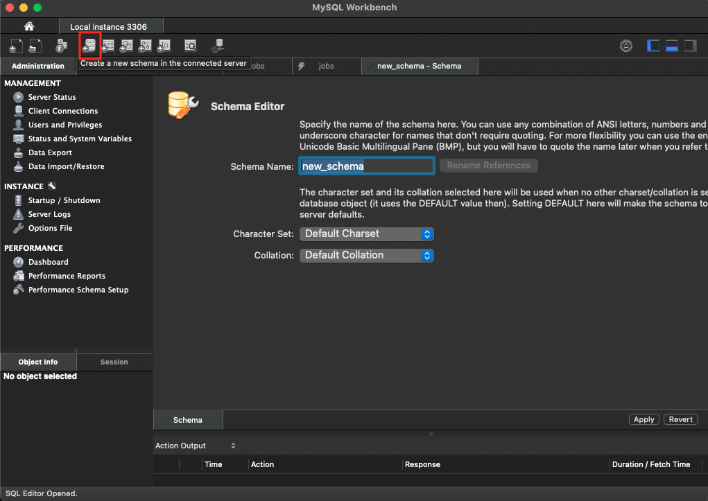

# Career Page - Zapay Pagamentos

## Overview
- The main purpose of this project is to build a webpage to show the carrer page from Zapay Pagamentos. The application provides knowledge about my studies on `Node.js`, `EJS` and `MySQL` 

- The theme used was Grayscale by Bootstrap.

  

### Libraries
- Bcrypt => secure password;
- Dotenv => Hide keys;
- EJS => Render HTML;
- Express => Flexible framework;
- Express-Session => Logged area;
- Nodemon => Update server;
- Sequelize => Manipulate database;

## Set Database on MySql

- As we use MySQL to build our data base, you can download it at this link if you don't have it already: 
`https://dev.mysql.com/downloads/mysql/ ` 
- Download `MySQL Workbench` at `https://www.mysql.com/products/workbench/`

### Configure database
- After installing `WorkBench` click on `MySQL Connections`:

  

  

- Then go on the top of the page and click on `Create new schema`

  

  

- The name of the `new_schema` must be `jobdescription`

### Configure env keys

- Add `.env` file into main folder, and put:

    - `DATABASE_PASSWORD = YourPassword`;
    - `DATABASE_USER = root`;
    - `DATABASE_TABLE = jobdescription`;
    - `DATABASE_HOST = localhost`;
    - `DATABASE_DIALECT = mysql`;
    - `SESSION_SECRET = secret`;

## Routes

    - localhost:3000/ => Main route;
    - localhost:3000/login => Login route;
    - localhost:3000/logout => Logout route;
    - localhost:3000/jobs/:id => Job description route by id;
 

  To access the routes below you need to login

    - localhost:3000/admin/jobs => Job list route;
    - localhost:3000/admin/jobs/new => Create job route;
    - localhost:3000/admin/jobs/edit/:id => Edit job route by id;
 

    - localhost:3000/admin/users => User list route;
    - localhost:3000/admin/users/new => Create user route;
    - localhost:3000/admin/users/edit/:id => Edit user route by id;

# About
Start Bootstrap is an open source library of free Bootstrap themes and templates. All of the free themes and templates on Start Bootstrap are released under the MIT license, which means you can use them for any purpose, even for commercial projects.

- https://startbootstrap.com
- https://twitter.com/SBootstrap

Start Bootstrap was created by and is maintained by David Miller.

- https://davidmiller.io
- https://twitter.com/davidmillerhere
- https://github.com/davidtmiller

Start Bootstrap is based on the Bootstrap framework created by Mark Otto and Jacob Thorton.

# Copyright and License
Copyright 2013-2021 Start Bootstrap LLC. Code released under the MIT license.